# [ChatGPT Guide](./README.md)

One ChatGPT Guide that you will only need for links and resources on ChatGPT and other large language models.
This guide is curated by Dr. Owen Chen from other resources.

# Coding with ChatGPT

One of the most intriguing ChatGPT capabilities is to write pretty good code. ChatGPT can write code in almost all computer programming languages:
Python, JavaScript, Java, Go, Ruby, C++, C#, PHP, Swift, TypeScript, and SQL.

Let's ask ChatGPT what languages can it code:

**Owen:**  Give a complete list of programming languages that you can code

**ChatGPT:**

    As an AI language model, I can understand and generate code in various programming languages. Here is a non-exhaustive list of programming languages that I can code:
    
    Python
    Java
    C#
    C++
    JavaScript
    Ruby
    PHP
    Swift
    Objective-C
    Kotlin
    Go
    Rust
    TypeScript
    SQL
    MATLAB
    Lua
    R
    Dart
    Shell scripting
    Perl
    Haskell
    Scala
    Groovy
    VB.NET
    Assembly language
    Fortran
    COBOL
    Lisp
    Prolog
    Scheme
    Tcl
    Smalltalk
    Ada
    Pascal
    BASIC
    Logo

    Please note that this list is not comprehensive, and there may be other programming languages that I can work with.


Impressive!  Let's see how well ChatGPT write code.

## Coding Example - Graph Data Structure

I volunteer to teach high-schoolers on a [computer science competition class](https://github.com/owenjchen/acsl_python) for a non-profit weekend school.  One of the subjects in the ACSL competitions is graph theory.  Let's see whether ChatGPT could write a class on a directed graph data structure.

A **directed graph** is a set of **vertices**, and a collection of directed **edges**. The directed edges are represented as ordered pairs of vertices (u,v).

Here is an example of a directed graph with 4 Vertices: A, B, C, D and 6 edges: (A,B), (A,D), (B,C), (B,D), (C,B) and (D,C):


We can also represent a directed graphy by an **adjacency matrix**.  The adjacency matrix for the above directed graph is:

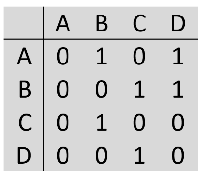

Let's ask ChatGPT and Bard how to write code on a directed graph.

### ChatGGPT - V1
**Owen:** Write a Python class for a directed graph using an adjacency matrix to represent the graph.

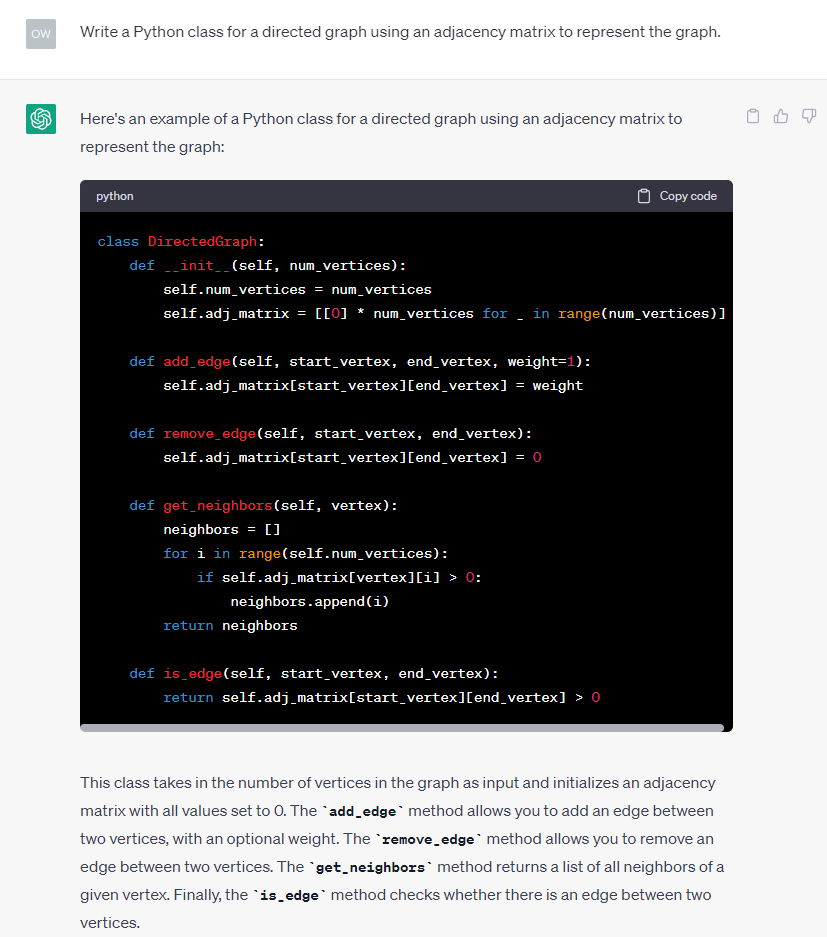

It initializes this graph class with a single integer argument - num_vertices and then creates a list of list data structure for an adjaceny matrix. It has methods to add edges, remove edges, get neighbors and check whether an edge exists in the graph.  It is a good working code!

### Bard - V1
How about we ask the same question on Google's Bard?

**Owen:** Write a Python class for a directed graph using an adjacency matrix to represent the graph.

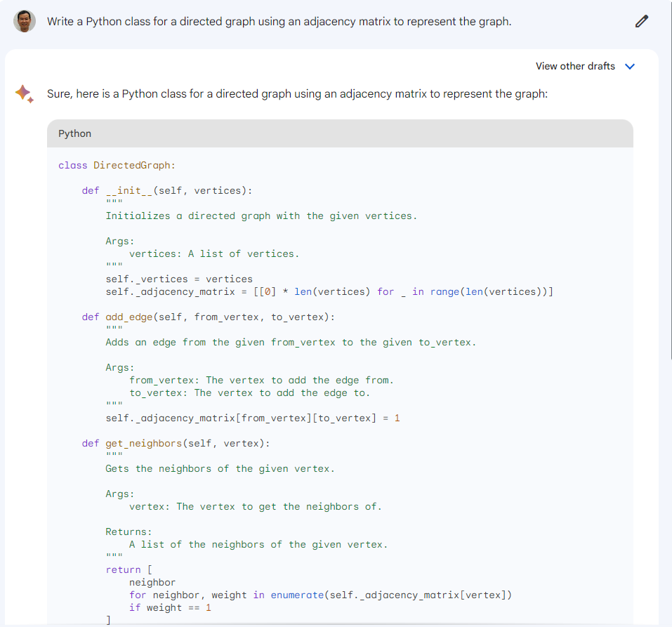
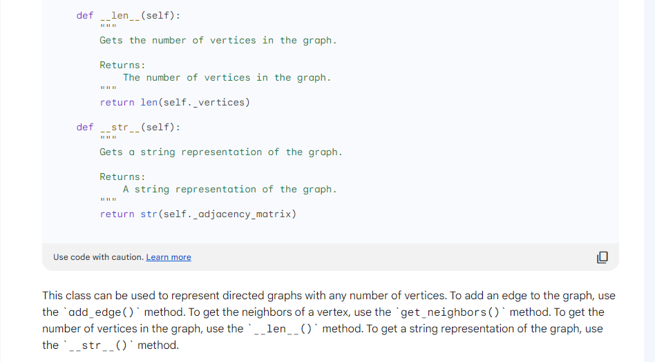


Cool! It is even better than ChatGPT's version!  It allows an input of list of vertices rather a fixed list of vertices from 0 to n.  In addition, it also has extra methods to count number of vertices and to print the adjacency matrix.

Aslo, Bard produces multiple versions of the code. Here are the other two versions:
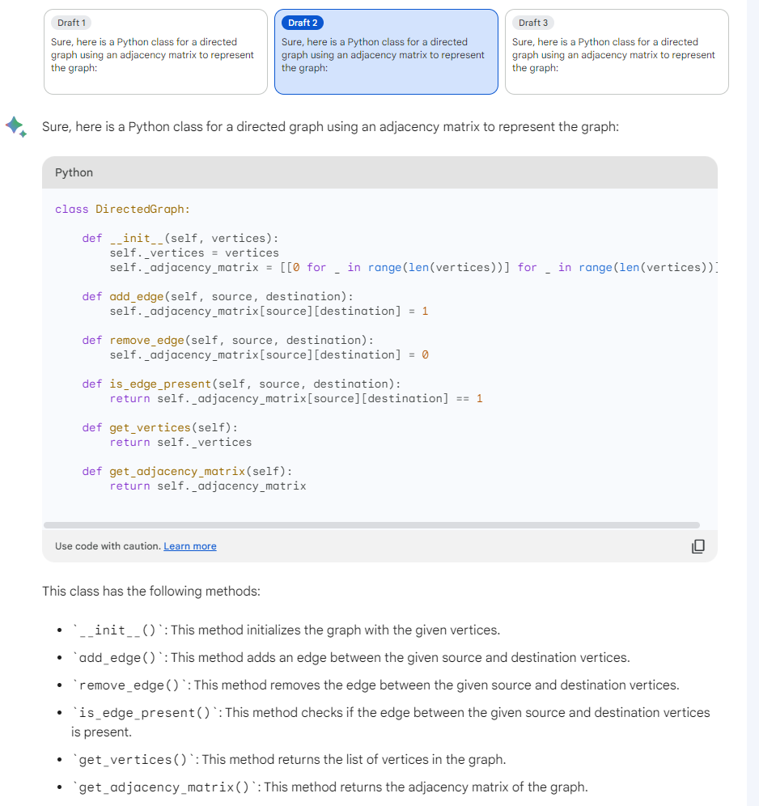
This second version is essentialy the same as the first one, except that it removes some comments and makes it shorter.

This 2nd version also gives an example of how to use the class:


There is a third version generated in the same prompt:


This 3rd version is almost identical to the first one - except the names of the arguments in some functions are changed.

On this example, Bard's code is slightly better than ChatGPT's.

So the winner of the first round of battle between ChatGPT and Bard goes to Bard!

### ChatGGPT - V2

One of the problems with a directed graph is to detect number of cycles in the graph.  Can ChatGPT enhance the graph class to detect cycles?

**Owen:** add a function to the above DirectedGraph class to detect cycles.

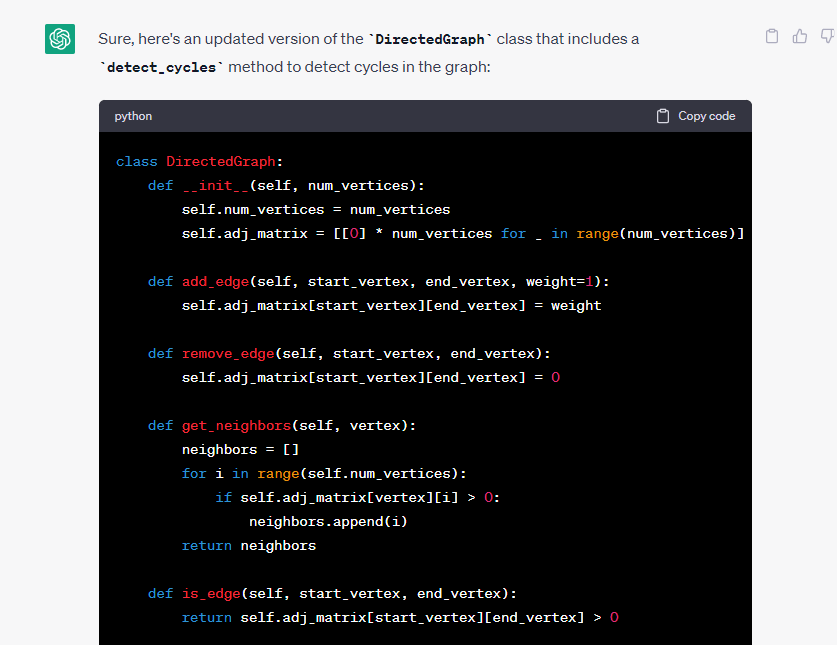


It adds detect_cycles() function and a helper function detect_cycles_hellper() to the class. It checks the adjacenty matrix for connectivity when getting a list of neighbors from a vertex. Excellent!

### Bard - V2
Can Bard add a function to detect cycles?
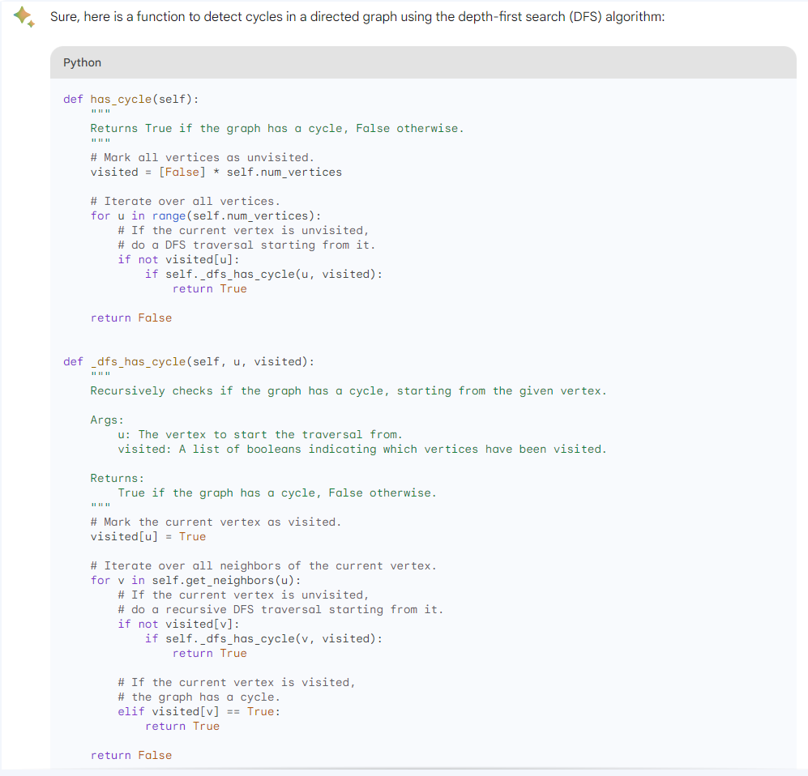

It uses a DFS to recusively check a cycle.

Unfortunately this Bard's cycle detection **code is wrong!** 
The Bard code on wrongly detect an acylic graph as cylical. 


So the winner of the second round between ChatGPT and Bard goes to ChatGPT!

### Bing Chat
Microsoft claims that Bing Chat is based on GPT4 with added a moderation technology known as Prometheus that connects with the Bing search engine to generate safer, faster, and more accurate answers. 

Let's see whether Bing Chat could code as well as ChatGPT does. 
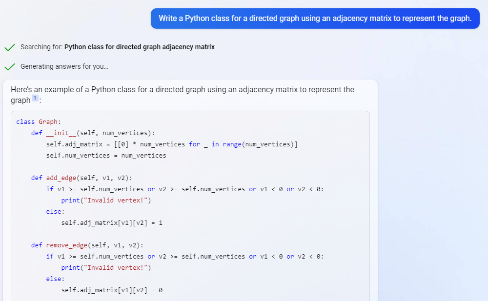


It rewrites my input as a search term of "Python class for directed graph adjacency matrix".  The output is similar to ChatGPT's code but it adds a usage example and references to sources.

### Bing Chat - V2
Check whether Bing Chat could enhance the code to detect a cycle.
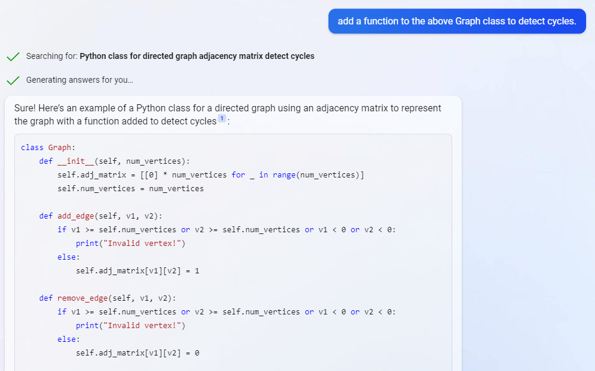


Unfortunately, Bing Chat gave a **wrong code** to detect a cycle! It does not check the adjacency matrix for the connectivity and the code will give a wrong answer!

It is disappointed that GPT4-based Bing Chat fails on this tasks while ChatGPT succeeds.  It could be due to a weakness in Bing's Prometheus tool.

### Claude+
I test Claude+ on Poe.com to write code on directed graph data structure as well.
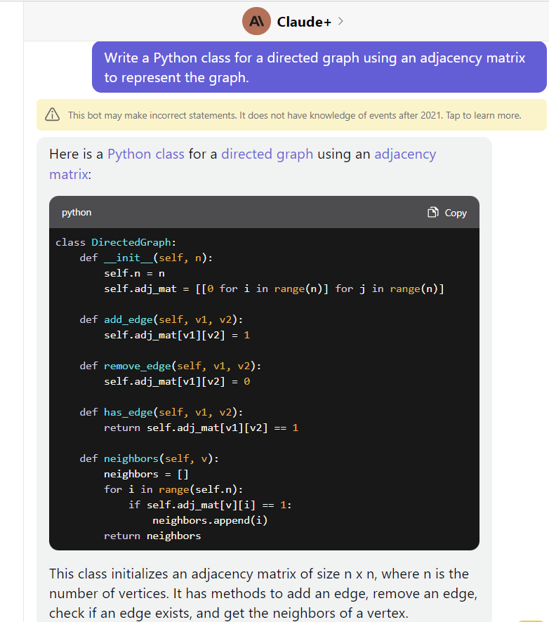
Not bad! It tends to use short variable names such as n, v, v1, v2 etc and there is no code comment.

How about adding a cycle detection?
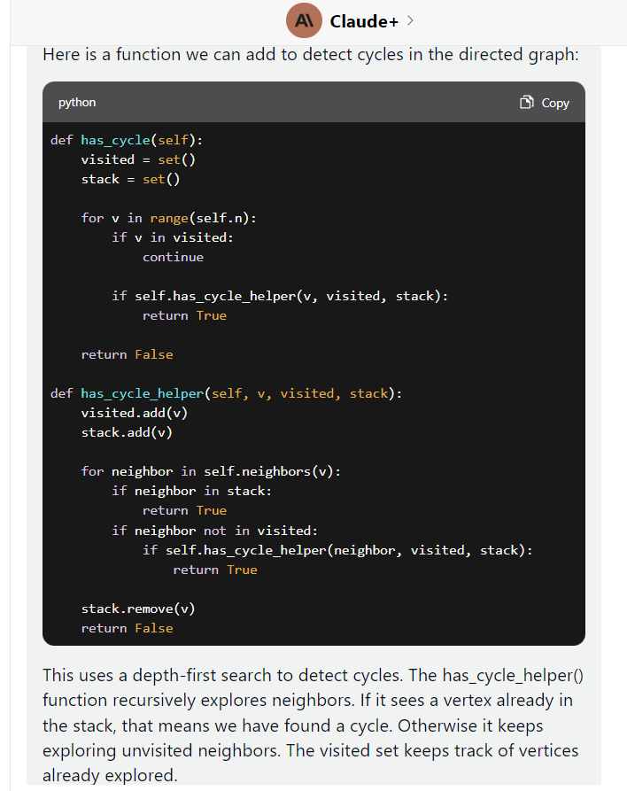

Wow! Claude+'s code works!

## Findings
ChatGPT, Bard, Bing and Claude+ are very good on writing a short programming code.  When asking to add additional complexity, both Bard and Bing produce wrong code.

All of the AI engines produce code to use numeric numbers from 0 to n to represent a graph with n+1 vertices.  They do not allow any string node label.

Below is the code that I wrote for my students in the ACSL class for a directed graph and an undirected graph.  This version allows string names for nodes (vertices).


    """
        Owen's Code for a directed graph and an undirected graph
    """
        
    class DiGraph(object):
        """
        A Directed Graph class
        edges is a dict mapping each node to a list of its children
        """
        def __init__(self):
            self.nodes = []
            self.edges = {}
            self.nedges = 0
            self.adjacency_matrix=[[]]

        def add_node(self, name):
            if name in self.nodes:
                print(f'Node {node} already in the graph.  Skip.')
            else:
                self.nodes.append(name)
                self.nnodes +=1
                self.edges[name] = []

        def add_nodes(self, nodes):
            for node in nodes:
                if node in self.nodes:
                    print(f'Node {node} already in the graph.  Skip.')
                else:
                    self.nodes.append(node)
                    self.edges[node] = []
                
        def add_edge(self, src, dest):
            if src not in self.nodes:
                self.add_node(src)
            if dest not in self.nodes:
                self.add_node(dest)
            self.edges[src].append(dest)
            self.nedges += 1 

        def build_adjacency_matrix(self):
            nnodes = len(self.nodes)
            self.adjacency_matrix = [ [0]*nnodes for _ in range(nnodes)]
            for i in range(nnodes):
                for j in range(nnodes):
                    if self.nodes[j] in self.edges[self.nodes[i]]:
                        self.adjacency_matrix[i][j] = 1
        
        def get_neighbors(self, node): 
            if node in self.edges.keys():       
                return self.edges[node]
            else:
                return None
        
        def has_node(self, node):
            return node in self.nodes

        def has_edge(self, source, destination):
            return destination in self.edges[source]
        
        def print_nodes(self):
        return 'Nodes: [' + ','.join(self.nodes) + ']\n'
            
        def print_edges(self):
            result = 'Edges: \n'
            for src in self.edges.keys(): 
                for dest in self.edges[src]:
                    result = result + "    (" + src + '-->' + dest + ')\n'
            return result
                
        def print_adjacency_matrix(self):
            result = 'Adjacency Matrix: \n    ['
            for i in range(len(self.nodes)):
                result += '[' + ','.join([str(k) for k in self.adjacency_matrix[i]]) + ']\n    '
            # Replace last return with ']'
            result = result[:-5]  + ']\n'
            return result
                    
        def __str__(self):
            result = ''
            result += self.print_nodes()
            result += self.print_edges()
            result += self.print_adjacency_matrix()
            return result
        
        def detect_cycle(self):
            """
            Detect whether the graph has a cycle by walking with Depth First Search (DFS) 
            Use two sets:  visited, and recursiveStack to mark the walk. 
            Returns true if graph is cyclic else false
            """
            visited = set()
            recursiveStack = set()
            
            for node in self.nodes:
                if node not in visited:
                    if self.dfs_detect_cycle(node, visited, recursiveStack):
                        return True
            return False
        
        def dfs_detect_cycle(self, v, visited, recursiveStack):
            """ Mark current node as visited and adds to recursion stack"""        
            visited.add(v)
            # push current node to stack
            recursiveStack.add(v)
            
            # Recursive for all neighbours 
            # if any neighbour is visited and in recursiveStack then graph is cyclic
            for neighbor in self.get_neighbors(v):
                if neighbor not in visited:
                    if self.dfs_detect_cycle(neighbor, visited, recursiveStack):
                        return True
                elif neighbor in recursiveStack:
                    return True

            # Pop the current node
            recursiveStack.remove(v)
            return False

        

    # Undirected Graph - only need to update add_edge() function
    class Graph(DiGraph):
        """
        An undirected Graph class in which all edges are bidirectional
        """    
        def add_edge(self, src, dest):
            DiGraph.add_edge(self, src, dest)
            DiGraph.add_edge(self, dest, src)                                              


    # Test code
    if __name__ == '__main__' :    
        print("Create a directed graph")
        graph = DiGraph()

        # add the nodes to the graph
        graph.add_nodes(['a','b','c','d','e'])

        # add the edges to the graph
        graph.add_edge('a','b')
        graph.add_edge('a','c')
        graph.add_edge('a','d')
        graph.add_edge('b','c')
        graph.add_edge('b','d')
        graph.add_edge('c','d')
        graph.add_edge('c','e')
        graph.add_edge('d','e')
        
        # Build Adjacency Matrix
        graph.build_adjacency_matrix()
            
        # print neighbors node C
        neighbors = ','.join(graph.get_neighbors('c'))
        print('Neighbor Nodes that Node C can walk to are: ', neighbors)
        
        # print the graph
        print('The nodes and edges in the graph are:')
        print(graph)
        
        # detect cycle
        if (graph.detect_cycle()):
            print("Graph has at least one cycle.")
        else:
            print("Graph has no cycle.")
            
        print("add a new edge (e-->a)")
        graph.add_edge('e','a') 
        graph.build_adjacency_matrix()    
        # print the graph
        print('The nodes and edges in the graph are:')
        print(graph)
        
        # detect cycle
        if (graph.detect_cycle()):
            print("Graph has at least one cycle.")
        else:
            print("Graph has no cycle.")           
            
        # create an undirected graph 
        print("Create an undirected graph:")
        graph2 = Graph()

        # add the nodes to the graph
        graph2.add_nodes(['a','b','c','d','e'])

        # add the edges to the graph
        graph2.add_edge('a','b')
        graph2.add_edge('a','c')
        graph2.add_edge('a','d')
        graph2.add_edge('b','c')
        graph2.add_edge('b','d')
        graph2.add_edge('c','d')
        graph2.add_edge('c','e')
        graph2.add_edge('d','e')
        
        # Build Adjacency Matrix
        graph2.build_adjacency_matrix()
            
        # print neighbors node C
        neighbors = ','.join(graph2.get_neighbors('c'))
        print('Neighbor Nodes that Node C can walk to are: ', neighbors)
        
        # print the graph
        print('The nodes and edges in the graph are:')
        print(graph2)
        
        # detect cycle
        if (graph2.detect_cycle()):
            print("Graph has at least one cycle.")
        else:
            print("Graph has no cycle.")
                

Here is the output from my code on a directed graph example:

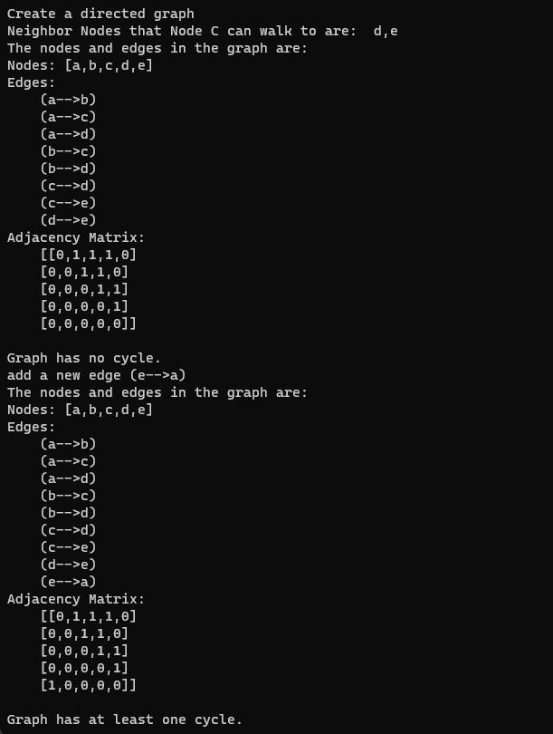

Recreate the same example in an undirected graph:


## Owen's Code for Directed Graph
### Version 2 - using Networkx module


```python
%matplotlib inline
import networkx as nx
import numpy as np
import matplotlib.pyplot as plt

graph = nx.DiGraph()
# add the edges to the graph
graph.add_edge('a','b')
graph.add_edge('a','c')
graph.add_edge('a','d')
graph.add_edge('b','c')
graph.add_edge('b','d')
graph.add_edge('c','d')
graph.add_edge('c','e')
graph.add_edge('d','e')
```


```python
nodes = [node for node in graph.nodes()]
nodes
```

    ['a', 'b', 'c', 'd', 'e']


```python
edges = [edge for edge in graph.edges()]
edges
```

    [('a', 'b'),
     ('a', 'c'),
     ('a', 'd'),
     ('b', 'c'),
     ('b', 'd'),
     ('c', 'd'),
     ('c', 'e'),
     ('d', 'e')]


```python
mat = nx.adjacency_matrix(graph, dtype=np.int32)
print(mat.todense())
```
    [[0 1 1 1 0]
     [0 0 1 1 0]
     [0 0 0 1 1]
     [0 0 0 0 1]
     [0 0 0 0 0]]


```python
positions = {"a": (0, 0), "b": (1, -2), "c": (1, 2), "d": (2, -2), "e":(2,2)}
nx.draw_networkx_nodes(graph,pos=positions, node_size=500)
nx.draw_networkx_labels(graph, pos=positions, font_color="w")
nx.draw_networkx_edges(graph,pos=positions, arrowstyle="->")
```

    

   


```python
if nx.is_directed_acyclic_graph(graph):
    print("No cycle in the directed graph")
else:
    print("There are cycle(s) in the directed graph")
```

    No cycle in the directed graph


```python
# Find cycles in the graph
cycles = list(nx.simple_cycles(graph))

# Print the cycles in the graph
if cycles:
    print("Cycles in the graph:")
    for cycle in cycles:
        print(cycle)
else:
    print("No cycles in the graph")

```

    No cycles in the graph


```python
graph.add_edge('e','a')
```


```python
edges = [edge for edge in graph.edges()]
edges
```

    [('a', 'b'),
     ('a', 'c'),
     ('a', 'd'),
     ('b', 'c'),
     ('b', 'd'),
     ('c', 'd'),
     ('c', 'e'),
     ('d', 'e'),
     ('e', 'a')]

```python
mat = nx.adjacency_matrix(graph, dtype=np.int32)
print(mat.todense())
```

    [[0 1 1 1 0]
     [0 0 1 1 0]
     [0 0 0 1 1]
     [0 0 0 0 1]
     [1 0 0 0 0]]


```python
positions = {"a": (0, 0), "b": (1, -2), "c": (1, 2), "d": (2, -2), "e":(2,2)}
nx.draw_networkx_nodes(graph,pos=positions, node_size=500)
nx.draw_networkx_labels(graph, pos=positions, font_color="w")
nx.draw_networkx_edges(graph,pos=positions, arrowstyle="->")
```
    

    

```python
if nx.is_directed_acyclic_graph(graph):
    print("No cycle in the directed graph")
else:
    print("There are cycle(s) in the directed graph")
```

    There are cycle(s) in the directed graph


```python
# Find cycles in the graph
cycles = list(nx.simple_cycles(graph))

# Print the cycles in the graph
if cycles:
    print("Cycles in the graph:")
    for cycle in cycles:
        print(cycle)
else:
    print("No cycles in the graph")
```

    Cycles in the graph:
    ['c', 'e', 'a']
    ['c', 'e', 'a', 'b']
    ['c', 'd', 'e', 'a']
    ['c', 'd', 'e', 'a', 'b']
    ['d', 'e', 'a']
    ['d', 'e', 'a', 'b']


<hr>

## [ChatGPT Guide](./README.md)
### [What is ChatGPT and How to get started?](./intro.md)
### [Coding with ChatGPT](./code.md)
### [ChatGPT FAQs](./faq.md)
### [ChatGPT News](./news.md)
### [ChatGPT Prompt Templates](./prompts.md)
### [ChatGPT Technical Guide](./techguide.md)
### [ChatGPT Resources](./resources.md)
### [ChatGPT Alterantives](./alternatives.md)
### [ChatGPT Papers](./papers.md)

<hr>

### [License: MIT License](LICENSE)

### Last Updated by: Owen Chen, Ph.D.
### Date: April 29, 2023
