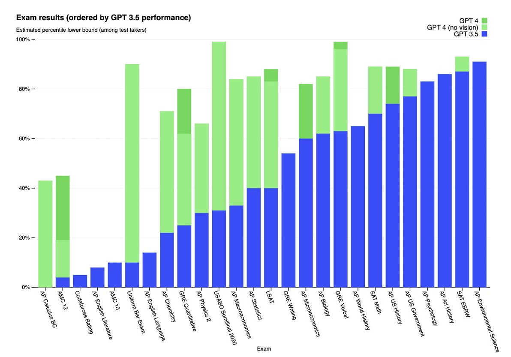
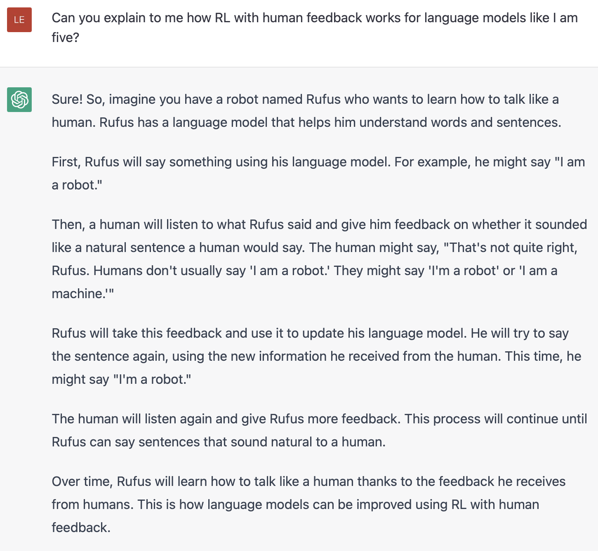
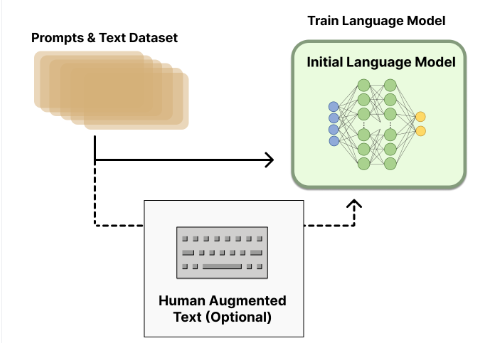
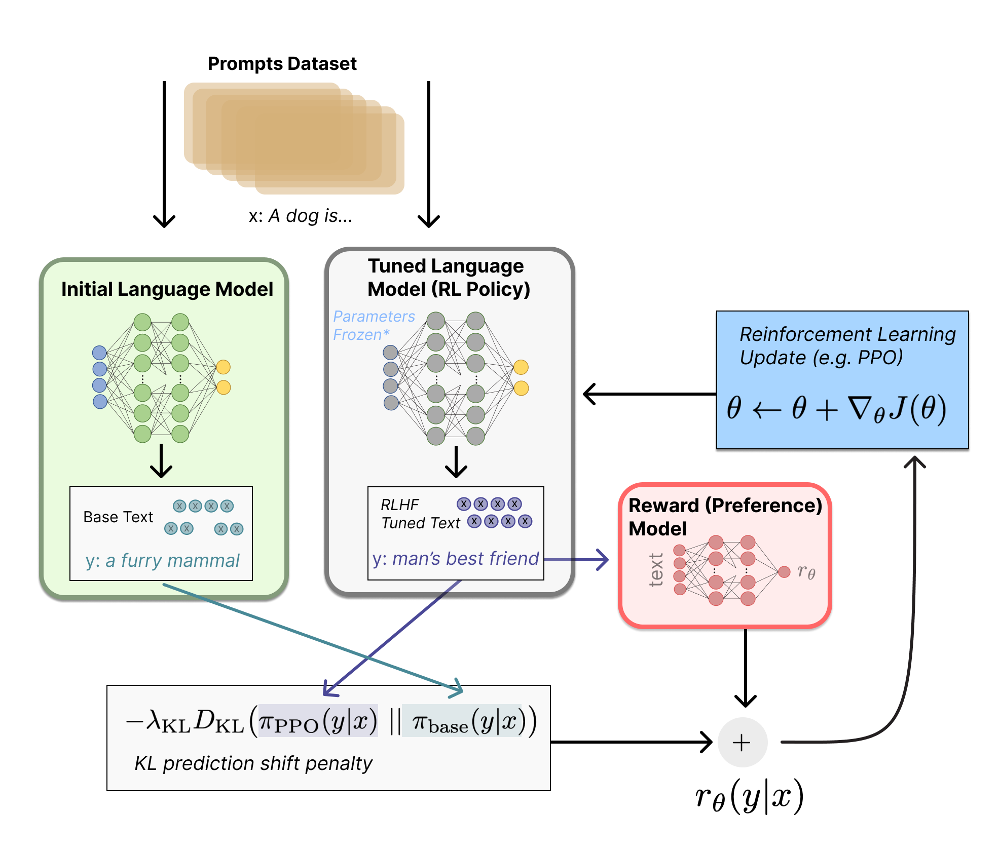
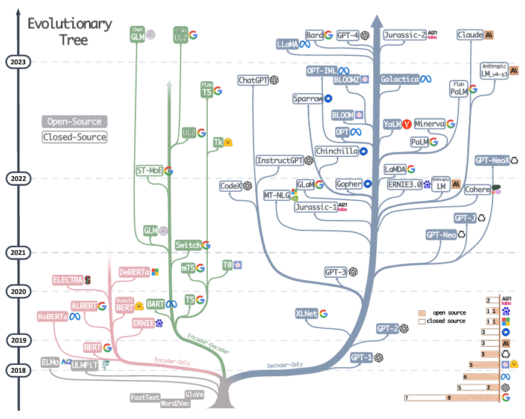

# [ChatGPT Guide](./README.md)

One ChatGPT Guide that you will only need for links and resources on ChatGPT and other large language models.
This guide is curated by Dr. Owen Chen from other resources.

# What is ChatGPT and How to Get Started?

ChatGPT, OpenAI’s AI chatbot, has taken the world by storm. It has the world knowledge at its disposal and can answer your questions, write essays, compose a poem, crack a joke, take a standard test exam, write code in any programming language.

## What is ChatGPT?

ChatGPT is an artificial intelligence (AI) chatbot developed by OpenAI and released in November 2022. ChatGPT is a sophisticated tool that has been designed to help solving problems and exploring ideas through natural language processing. It is designed to provide natural, fluid, dialogue-like responses to queries. ChatGPT can understand and generate human languages with remarkable accuracy and fluency. 

ChatGPT is the latest generative pre-trained transformer (GPT) language model trained by OpenAI. It is built on OpenAI's GPT families of large language models (LLMs).  ChatGPT was optimized for dialogue by using Reinforcement Learning with Human Feedback (RLHF) – a method that uses human demonstrations and preference comparisons to guide the model toward desired behavior. The latest version of GPT is GPT-4 but it has a very limited access.  The widely available ChatGPT is based on GPT-3.5.

ChatGPT's primary function is conversation AI, that is an AI engine can communicate with people in a natural, conversational manner, allowing them to ask questions, make requests, or engage in discussions on a wide range of topics. 

In addition, ChatGPT can perform other tasks that involve natural language processing, such as text classification, sentiment analysis, language translation, summarization, and more. 

## Official Resources

- [ChatGPT app](https://chat.openai.com/)
- [ChatGPT overview](https://openai.com/blog/chatgpt/)
- [ChatGTP Discord](https://discord.com/invite/openai)

## What Can ChatGPT Do?

One remarkable demonstration on the capabilities of large language models (LLMS) like GPT3 and GPT4 is the following diagram produced by OpenAI to the standardized test scores that GPT3.5 and GPT4 did.

(Source:https://arxiv.org/pdf/2303.10130.pdf)

Here are some example use cases of ChatGPT:

1. Answering Questions: People often ask me various types of questions, ranging from simple factual questions to complex, open-ended ones. I can answer questions on a wide range of topics, including science, history, culture, entertainment, and more.

2. Language Translation: I can translate text from one language to another. This is particularly useful for people who need to communicate with others who speak a different language.

3. Text Summarization: I can summarize long texts into shorter, more manageable ones. This is useful for people who need to quickly understand the main points of a long document or article.

4. Sentiment Analysis: I can analyze the sentiment of a piece of text, which is useful for businesses that want to understand how their customers feel about their products or services.

5. Content Creation: I can generate text on a variety of topics, which is useful for content creators who need to produce a large amount of content quickly.

6. Personal Assistant: I can act as a personal assistant, helping people with tasks such as scheduling appointments, making reservations, and more.

7. Chatbot: I can act as a chatbot, engaging in conversation with users on a variety of topics.

8. Customer Support: I can provide customer support, answering questions and resolving issues for customers.

9. Educational Tool: I can be used as an educational tool, helping students learn about various topics and providing them with additional resources and information.

10. Research Tool: I can be used as a research tool, helping researchers find information on a variety of topics and providing them with insights into their research areas.

These are just a few examples of the many use cases for which ChatGPT can do. 

## How does ChatGPT work?

ChatGPT is an AI language model that is based on the GPT (Generative Pretrained Transformer) architecture, which was developed by OpenAI. GPT is a type of neural network that is trained on large amounts of text data using unsupervised learning.

Here is a high-level overview of how ChatGPT works:

**Training**: To train the model, large amounts of text data are fed into the network, which learns to predict the next word in a sentence based on the words that came before it. The model uses a technique called unsupervised learning, which means that it does not require labeled data to learn.

**Fine-Tuning**: After the initial training, the model can be fine-tuned on specific tasks by providing it with labeled data and adjusting its parameters accordingly. This process helps the model adapt to specific contexts and tasks.

**Inference**: During inference, the model takes in a piece of text as input and generates a response based on its training and fine-tuning. The response is generated using a technique called autoregression, in which the model generates one word at a time based on the previous words it has generated.

**Optimization**: To ensure that the responses generated by the model are of high quality, various optimization techniques are used, such as beam search and sampling. These techniques help the model generate responses that are coherent, relevant, and diverse.

Overall, ChatGPT works by using a neural network to analyze large amounts of text data and generate responses based on its training and fine-tuning. The model has the ability to generate natural language responses that can be used for a variety of tasks, including answering questions, generating text, and providing assistance in various domains.

## Reinforcement Learning from Human Feedback (RLHF)
We asked ChatGPT to explain RLHF:

### Pretraining language models

### Reward model training

### Fine-tuning with RL

## Large Language Model Evolution

Source: https://huggingface.co/blog/rlhf

## How to sign up a free ChatGPT account?
You will need to set up a free account with OpenAI before getting started. 

Go to http://chat.openai.com/ and click "sign up".

You have the option of choosing an easy login with a Google or Microsoft account, or just entering your email address. You will need a mobile phone number that can receive a text confirmation number to complete the signup.

## How to use ChatGPT?
Once your account is set up, open http://chat.openai.com/ with your favorite browser and start interacting with ChatGPT.

## Is ChatGPT free to use?
Yes, the basic version of ChatGPT is completely free to use. However, sometime the ChatGPT has reached the capacity and you can not log in. There’s no limit to how much you can use ChatGPT in a day.  However there is a limit on how much text you can submit in each prompt and a limit on the length of a ChatGPT's response.

## Other ways to use ChatGPT

In addition to chat.openai.com browser interface, there are other ways to use ChatGPT:

### OpenAI API.  
There is a developer API interface for all OpenAI models, including ChatGPT and earlier versions of GPT.  You can call ChatGPT through a curl command, Node JS or Python.  See 
https://platform.openai.com/

### OpenAI Playground
This OpenAI Playground has an UI interface that allows more controls on the interaactions, including changing values of parameters:
https://platform.openai.com/playground?mode=chat

However, both the API calls and the playground interactions are not free.  There is a cost for each API call.  When you sign up an OpenAI account,  you will receive an initial credit of $5 when you sign up an openai account.

### Bing
The latest version of Microsoft Edge has a new Bing built-in on the sidebar

## Write a Joke about ChatGPT

**Owen:** Write a Joke for a group of coworkers who are learning ChatGPT on Tuesday.

**ChatGPT:** Why did the computer go to the doctor? Because it had a virus! But don't worry, ChatGPT is vaccinated and ready to help us tackle any questions or challenges we may have on this Tuesday!

## Write a Joke

**Owen:** 

**ChatGPT:** 

## Can ChatGPT write code?

**Owen:** You did not mention that you can write code.  What programming languages can you write?

**ChatGPT:** As an AI language model, I do not have the capability to write code in the traditional sense. However, I can provide assistance to programmers and developers in a variety of ways, such as answering programming-related questions, explaining programming concepts and techniques, and providing code snippets and examples.

Additionally, I can provide guidance on how to use programming tools and frameworks, and suggest best practices for programming and software development. Some of the programming languages and technologies that I am familiar with include Python, Java, C++, JavaScript, SQL, HTML/CSS, and various machine learning frameworks such as TensorFlow and PyTorch.

While I cannot directly write code or execute programs, I can be a valuable resource for programmers and developers looking to improve their skills and knowledge, and to solve programming-related problems.

## A sample Python code ChatGPT wrote

**Owen:** Write a Python class for a binary tree.

ChatGPT: Sure, here's an example implementation of a Python class for a binary tree:

    class BinaryTree:
        def __init__(self, value):
            self.value = value
            self.left_child = None
            self.right_child = None
        
        def insert_left(self, value):
            if self.left_child is None:
                self.left_child = BinaryTree(value)
            else:
                new_node = BinaryTree(value)
                new_node.left_child = self.left_child
                self.left_child = new_node
        
        def insert_right(self, value):
            if self.right_child is None:
                self.right_child = BinaryTree(value)
            else:
                new_node = BinaryTree(value)
                new_node.right_child = self.right_child
                self.right_child = new_node
        
        def get_left_child(self):
            return self.left_child
        
        def get_right_child(self):
            return self.right_child
        
        def set_root_val(self, value):
            self.value = value
        
        def get_root_val(self):
            return self.value

Let's have a deep look at coding skills of ChatGPT, Bard and Bing Chat [here](./code.md).

## Limitations
Despite its capabilities, ChatGPT has its limitations. Most importantly, it still is not fully reliable - it **hallucinates** facts and makes reasoning errors. Great care should be taken when using language model outputs.

## [ChatGPT Guide](./README.md)
### [What is ChatGPT and How to get started?](./intro.md)
### [Coding with ChatGPT](./code.md)
### [ChatGPT FAQs](./faq.md)
### [ChatGPT News](./news.md)
### [ChatGPT Prompt Templates](./prompts.md)
### [ChatGPT Technical Guide](./techguide.md)
### [ChatGPT Resources](./resources.md)
### [ChatGPT Alterantives](./alternatives.md)
### [ChatGPT Papers](./papers.md)

### [License: MIT License](LICENSE)

### Last Updated by: Owen Chen, Ph.D.
### Date: April 29, 2023